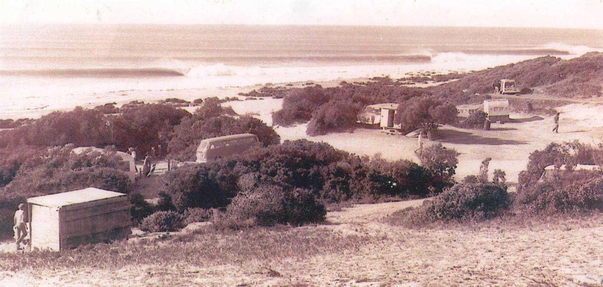
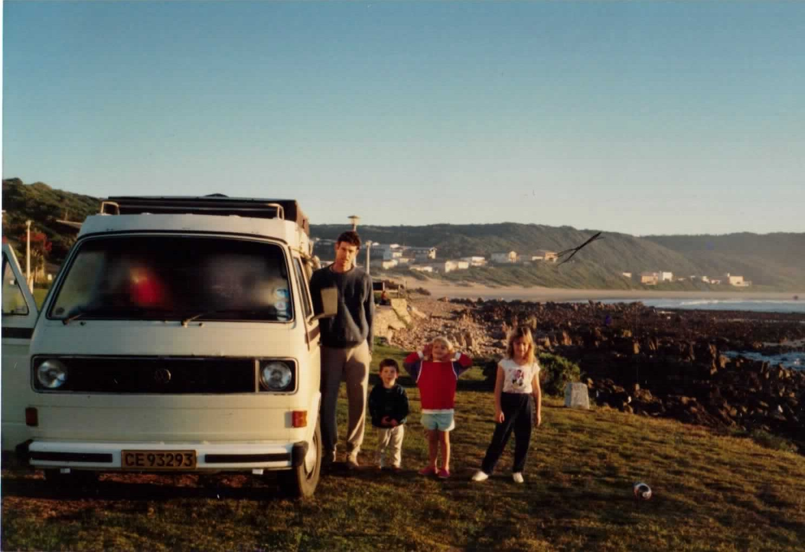
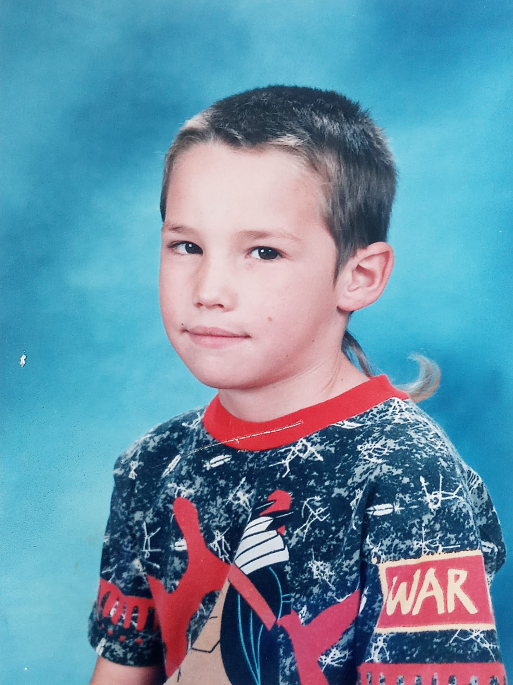
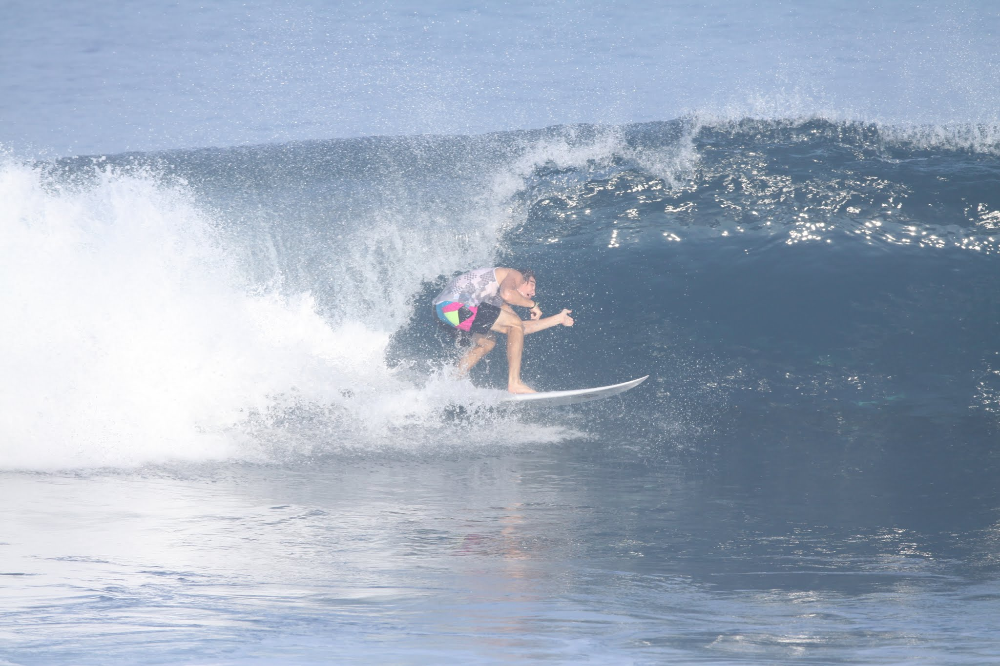
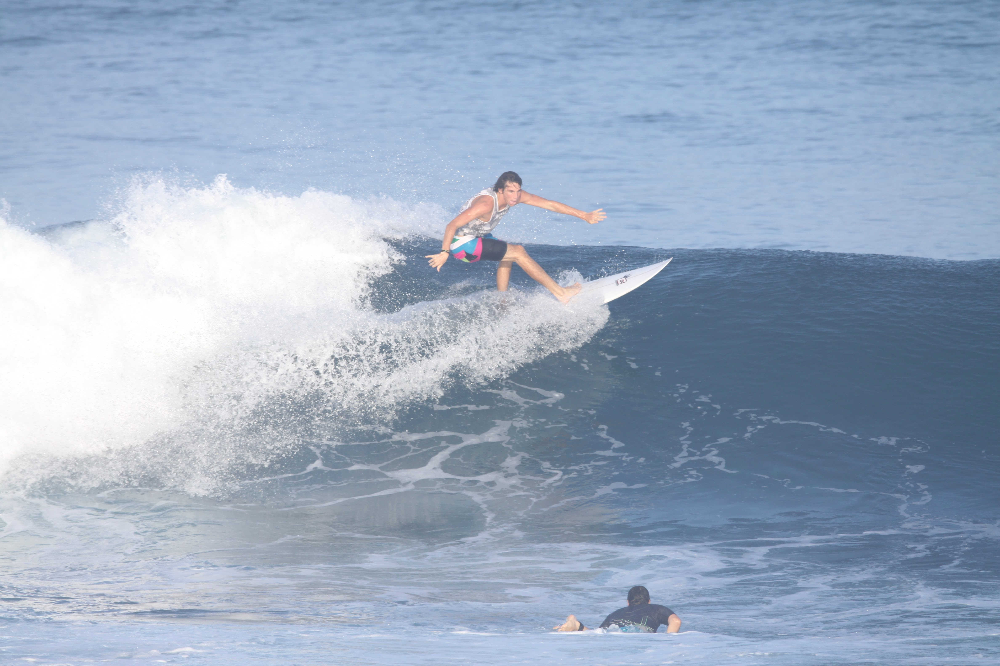

# Lets get Beryl'd 🌊

> A new wave in surfing

<!-- note

* Surfing transforming like cricket + t20

* Momentum behind making artificial waves viable business.

* What makes surfing, surfing.

* I'll take you through jbay.

I couldn't think of a better metaphor, but to me, it surfing is going through a similar transformation that cricket did 10 years ago with the invention of t20 cricket. There is a lot of momentum being put into making artificial waves become viable for business and surfers but it also leaves people wander what makes surfing, surfing.

I'll take you through the wave I grew up surfing and how everyone is trying to recreate it in an attempt to commodify the ocean wave.
-->

---

<!-- note
* 1963 bruce brown - endless summer.
* 1964 jbay is ridden for the first.
* Surf is temperamental

In 1963, bruce brown made the famous surf documentary looking for the perfect wave, and decide it was in St Francis, he said it broke 300 days of the year even though he was only their for a couple days. Jbay was first ridden in 1964 and everyone realized brown had missed the real perfect wave by about 20km. - shows you how temperamental weather + surf can be.
-->

---

<!-- note
So I grew up surfing JBay, which is a righthand point break. This is us there as kids, I wasn't in the picture because my mom didn't allow me in family photographs until I cut my rats tail.

* Right hand break - sucks for goofy footer.
-->

---

---

<!-- note
What makes jbay so good?
-->

---

## Swell exposure

---

<!-- note
* Local winds don't create waves
* Waves blowing over ocean for a long distance do.
* South atlantic has pressure system in to the south west that sends swell across the coast. 
* In summer this highpressure drops down and blocks most of the swell but in winter the direction is perfect. 
-->

---

## Consistent Offshore winds

<!-- note
We have consistent offshore winds in winter we have berg winds, winds that blow from the bergs(mountains) offshore to the ocean this are usually light and improve the shape of the wave.
-->

---

## Rock formation + swell angle.

---

<!-- note
We have swells that come in across the coast and wrap around the point as the friction catches them. This is different from say a beach break where sand bars consistently change and therefore change the way the wave breaks. Jbay is pretty consistent breaks the same as long as the tide and swell direction is the same. (The other type of break is a reef break) It just means the wave hits the reef at once rather than wrapping around a point it generally just pitches and throws as a pose to peeling.
-->

---

# So how do we recreate jbay with technology?

<!-- note
* One way is if you have the most of the ingredients - for instance swell + wind direction but you had a inconsistent of disruptive bathomtry. 

* Then you could create a artificial reef to help sculpt the wave.

* But for projects like that you need local goverment that is will to take a risk on unproven technology.
-->

---
## Bournemouth

<!-- note
* cost 3mill pounds (2.5% of councils annual budget)
* Supposed to double the annual surfing days and increase wave size by 30%.  
* Geotextile sandbags.
* Company went under before they could get their money.
-->

---

> The artificial reef will now be left to the elements and, according to one local, a 'sunken memorial to council incompetence.

<!-- note
There have been other efforts in India and the states but no success stories I think in most cases you need a lot more money than you think and that the real big win lies in consistent swell than the reef shape.
-->

---

## So how do you make consistent swell

---

## WavePools

<iframe width="560" height="315" src="https://www.youtube.com/embed/Uz_A6VDUbSI?start=50" frameborder="0" allow="accelerometer; autoplay; encrypted-media; gyroscope; picture-in-picture" allowfullscreen></iframe>

<!-- note
The first one was made in Munich Germany in 1914, people seemed to like it but it was a machine that displaced water (in the cage) pumping back and forth. So it was more like chop that waves and wasn't at all ridable.

There have been alot of wave pools in the years since but only the last few years have they started to make waves worth talking about.

There are currently ~3 strategies to making wave pool waves.
-->

---

# The Hydrofoil

<iframe src="https://player.vimeo.com/video/249455918?title=0&byline=0&portrait=0" width="640" height="360" frameborder="0" allow="autoplay; fullscreen" allowfullscreen></iframe>

<a href="https://vimeo.com/249455918">The Evolution of the Wave</a> from <a href="https://vimeo.com/kswaveco">Kelly Slater Wave Co</a> on <a href="https://vimeo.com">Vimeo</a>.

<!-- note
Underwater plow, much like a train engine that pushes a submerged airplane wing which forces water against a contoured bottom until it curls into a perfect 45 second barrel of a wave.

By making changes to the Hydrofoil they are able to create 50 different types of waves (whatever that means)
-->

---

# Hydrofoil

<iframe src="https://player.vimeo.com/video/165652304?title=0&byline=0&portrait=0" width="640" height="360" frameborder="0" allow="autoplay; fullscreen" allowfullscreen></iframe>

<a href="https://vimeo.com/165652304">The Perfect Canvas</a> from <a href="https://vimeo.com/kswaveco">Kelly Slater Wave Co</a> on <a href="https://vimeo.com">Vimeo</a>.

---

# Hydrofoil (downsides)

- Have to wait for energy to disipate (3 min between waves) / lots of current

- Fresh water which makes you board not as boyant.

- Lots of them aren't as good (wave garden).

---

# PumpAction

> Making surf not waves

<iframe width="560" height="315" src="https://www.youtube.com/embed/t13Ftce68QY" frameborder="0" allow="accelerometer; autoplay; encrypted-media; gyroscope; picture-in-picture" allowfullscreen></iframe>

<!-- note
Waco texas.

I couldn't find much about this one but it's looking pretty good. They brag how their waves don't try make the perfect wave but rather imitate surf by having dynamic conditions that vary like the ocean. PerfectSwell®

Proprietary PerfectSwell® Reflecting Wave Generator creates waves with particle motion like the ocean. The PerfectSwell® Phased Array Control System controls air pressure firing patterns and sequences to create unlimited wave types. We have also developed a touch screen interface allowing the operator to effectively design their own wave. Infinite Ocean® is a brand new innovative approach to pool design creating an authentic and realistic beach.
-->

---

# The plunger

<iframe width="560" height="315" src="https://www.youtube.com/embed/eO4hJ5hODbc?start=39" frameborder="0" allow="accelerometer; autoplay; encrypted-media; gyroscope; picture-in-picture" allowfullscreen></iframe>

<!-- note

This one is pretty easy to understand they have a massive plunger and drop it down into the water raising it up with compressed air.

They'll have 5 different breaks around the plunger for different levels, and plan to color code the breaks like ski resorts code their slopes.

You need a bigger lake for this but because its a single source I think it'll be easier churn out more waves per minute. They say:

Waves per hour, allowing up to 240 surfers in the lake at the same time, all catching 10 waves per hour.
-->

---

# Olympics?

<!--
Now that its moneytized its heavily regulated.
-->

---

# New rules? 

<!-- note

* What is surfing.
* Searching for a wave or just standing a new one?  
* Counting sets.  
* I grew up counting sets, and trying to figure    
-->

<!-- note
All of these technologies are still pretty immature, I watched a demo of the surf lakes one and they broke the plunger when they tried to make it bigger than 4ft. 

Kelly's wave (with the hydrafoils is now a stop on the pro-surfing contest tournament) but is not open to the public I assume because of the high operating cost and the time between waves.

The PerfectSwell tech is actually open to the public in texas and is where the usa team is preparing for the olympics, all of these technologies tried to bid to be used in the 2020 olympics. 

where kelly slater actually built a wave pool (nearing completion) but tokyo endup choosing the ocean for their contest and it looks like paris olympics 2024 will do the same. Either way I guess in 10 years you'll be able to surf near London.
-->
